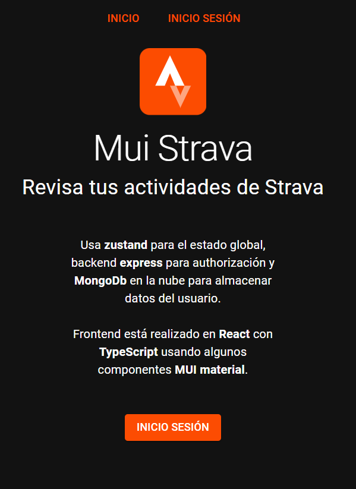
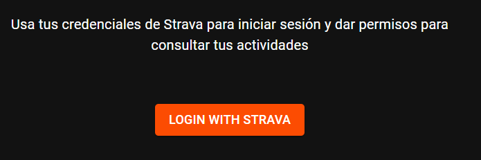
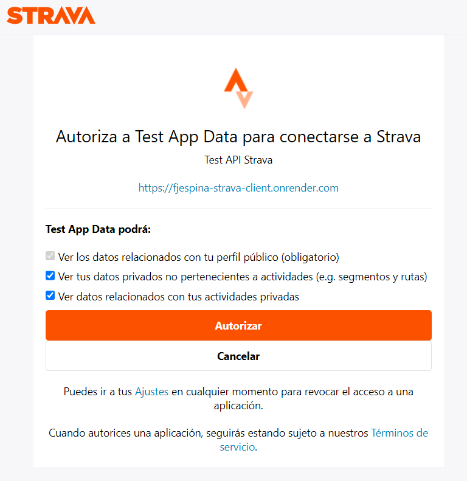
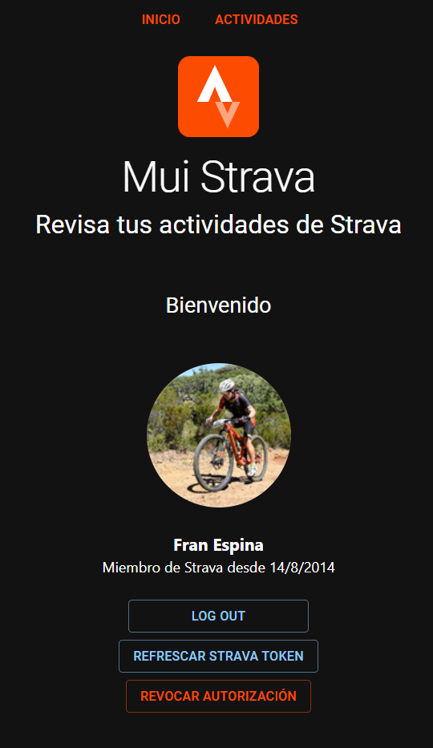
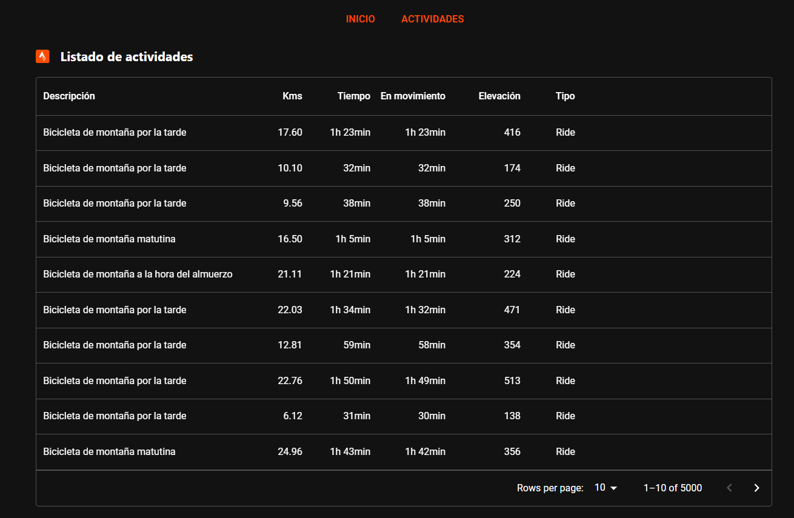
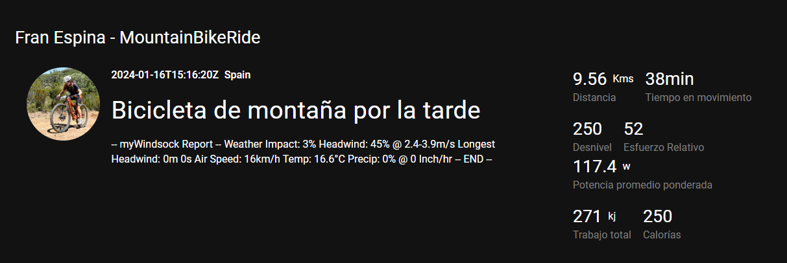
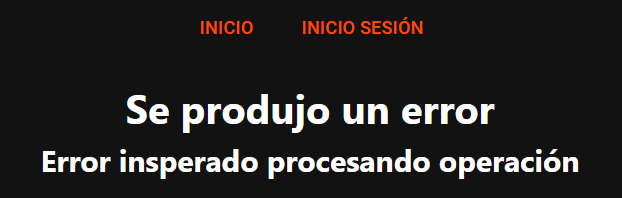

# MUI Strava
[Cliente web](https://fjespina-strava-client.onrender.com/) que consume datos del API de strava, permitiendo consultar el listado de actividades de un usuario que previamente ha autorizado el acceso.

## Funcionalidad
La página controla mediante el uso de almacenamiento local si el usuario tiene o no una sesión iniciada con Strava.

Si el usuario no tiene autorización se le presenta la página de incio desde la que puede acceder al inicio de sesión de Strava.

El usuario puede hacer login con sus credenciales de Strava y posteriormente debe autorizar 

- Si el usuario no autoriza la página llevará a la página de errores.
- Si se dan permisos:
  - Se usa el token de autorización recibido para solicitar un token de acceso y un token de refresco a Strava para poder mantener la sesión en el cliente.
  - Se redirecciona al usuario a la página de inicio, pero se muestran datos del usuario logado

Una vez logado, los datos para mantener la sesión abierta se guardan en el almacenamiento local del dispositivo. 

La aplicación es capaz de mantener el token vivo, mediante llamadas al backend para conectar con Strava y refrescar el token de accceso.

Desde la pantalla de inicio podremos finalmente acceder a las actividades del usuario.

Las actividades se muestran en una tabla y mediante doble click en una fila  podremos acceder al detalle de cada actividad, donde se nos mostraran algunos datos de ejemplo.

## Consideraciones sobre la sesión de Strava

Si el usuario entra en otro dispositivo, se loga, y autoriza, Strava  invalida cualquier token que pudiera tener el usuario aunque no haya expirado. 

En el backend se sincronizan los tokens de cada usuario para que siempre se tenga el último token vivo al refrescar. 

En la versión publicada no se activa esta funcionalidad porque el servidor no tiene IP Fija y no se puede garantizar el acceso al servidor de MongoDb donde está la base de datos por que tiene un filtro por IP que bloquea las consultas a datos.

## Gestión de errores
La gestión actual de errores es muy básica.
  - En la consola se muestra el error (no se han querido ocultar con datos técnicos )
  - Al usuario se le redirecciona a una ruta genérica para informar de un error.

## Algunos aspectos técnicos

- ``React`` y ``TypeScript`` en el frontend
  - Se han componetizado algunos elementos de la interfaz
- ``axios`` para la comunicación con el backend y con el API de Strava
- ``Zustand`` para mantener el estado global de la aplición
- Algunos componentes ``MUI Material``
- Se usa ``dotenv`` para gestionar las variables de entorno y actualmente se está desplegando en ``render``

## Backend
La aplicación hace uso de un backend para mantener la sesiones de Strava y para almacenar datos en MongoDb de la sesión del usuario.

Está realizado con express y vanilla Javascript.

Puede consultar más detalles en el [repositorio](https://github.com/FranEspina/api-strava/blob/master/README.md) en GitHub.

## Mejoras
- Responsive. Se han revisado algunos comportamientos para que la página sea responsive. Pero es muy mejorable. No era el objetivo.
- Accesibilidad. No se han realizado validaciones de accesibilidad, y se ha usado lo justo el HTML semántico. No era el objetivo.

